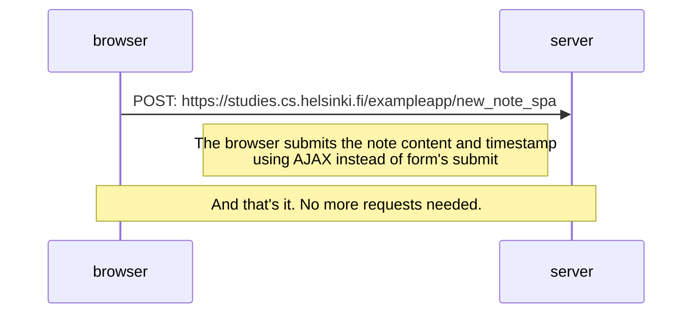

This time the default form action (submit values) is not triggered and an AJAX POST request is made instead. Thus the page is not refreshed.

```mermaid
sequenceDiagram
    participant browser
    participant server

    browser->>server: POST: https://studies.cs.helsinki.fi/exampleapp/new_note_spa
    Note left of server: The browser submits the note content and timestamp<br/>using AJAX instead of form's submit

    Note over browser,server: And that's it. No more requests needed.
  
```
  
